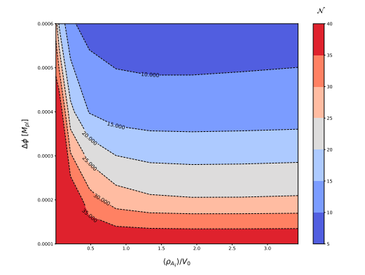
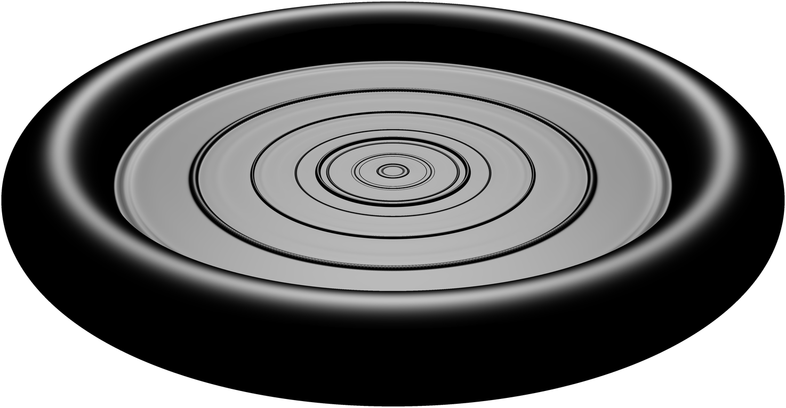
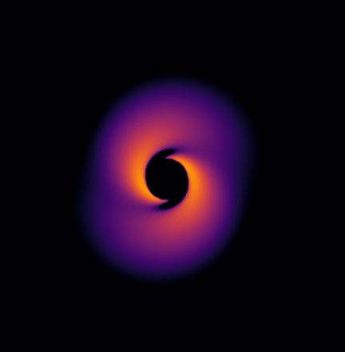

**The paper should be between 250 and 1000 words.**

# Summary

**A summary describing the high-level functionality and purpose of the software for a diverse, non-specialist audience.**

The 2015 detection of gravitational waves (GWs) from a binary black hole merger [@Abbott:2016blz] was a breakthrough moment for science. The LIGO and Virgo detectors have gone on to detect hundreds of candidate events, and the next decade promises a deluge of new data detected by a world-wide network of GW instruments including Advanced LIGO and KAGRA [@TheLIGOScientific:2014jea; @Aasi:2013wya; @Somiya:2011np], and in the longer term space based missions such as LISA [@Audley:2017drz] and Tianqin [@Luo:2015ght]. To make sense of the data streams we will receive we need to fully understand the theoretical predictions that are made by our current best theory of gravity, *General Relativity* (GR), including possible deviations relating to new physics.

GR is encapsulated by the Einstein Field Equations [@Einstein:1916vd]
\begin{equation}
   R_{\mu \nu} - \frac{1}{2} R g_{\mu \nu} = 8 \pi G T_{\mu\nu} ~.
\end{equation}
This elegant and concise form somewhat obscures the nature of the equations from those unfamiliar with the notation - expanded out, it is a set of second order partial differential equations for the metric tensor field $g_{\mu\nu}$, which describes the curvature of spacetime in the presence of matter with stress-energy $T_{\mu\nu}$, i.e.
\begin{equation}
   \partial_t \partial_t g_{\mu\nu} = \partial_x \partial_x g_{\mu\nu} + \partial_y \partial_y g_{\mu\nu} + \partial_z \partial_z g_{\mu\nu} + {\rm non ~ linear ~ cross ~ terms} 
          + 8 \pi G T_{\mu\nu}
\end{equation}
where the indices $\mu, \nu$ run over the spacetime indices - in 4 dimensions, $t, x, y, z$. Given that $g_{\mu\nu}$ is symmetric in its indices, this gives a set of ten coupled, non linear wave equations, sourced by the stress-energy of any matter present in the spacetime.

Beyond the perturbative regime or cases with high degrees of symmetry, analytic solutions to the Einstein equation are rare and in general the equations must be solved numerically. One common approach to this problem is to specify an initial spatial distribution for the metric and matter fields (subject to certain constraints), and then solve a time evolution for all metric and matter quantities, thus populating their values thoughout the four dimensional spacetime. The canonical example of this is the simulation of two black holes in orbit around each other, which permits extraction of the gravitational wave signal produced during the merger. Such numerical results have been instrumental in discovering signals in the noisy LIGO/VIRGO detector data, as well as confirming the predictions of GR to a high precision in the strong field regime.

In principle, time domain evolutions of coupled non linear wave equations are tractable numerical problems, but in practice there are a number of subtleties which meant that stable evolutions of black hole binary mergers, like those observed by LIGO, were not possible until the early 2000's. Four key breakthroughs which made such *Numerical Relativity* (NR) evolutions possible were:

1. The development of the ADM formulation of the Einstein equations in 1962 by Arnowitt, Deser and Misner [@Arnowitt:1962hi], as a Hamiltonian formulation of gravity.

2. The construction of a well posed formulation of the Einstein equations by Baumgarte, Shapiro, Shibata and Nakamura (with Oohara and Kojima, although the abbreviation is BSSN)  [@Nakamura:1987zz;@Shibata:1995we;@Baumgarte:1998te], enabling long term stable evolutions of strongly gravitating spacetimes.

3. The development in 2005 of suitable gauge choices for strong gravity [@Pretorius:2005gq;@Baker:2005vv;@Campanelli:2005dd]. In particular the use of Generalised Harmonic Coordinates (GHC) with explicit excision [@Pretorius:2004jg], and "moving puncture" gauge excision, enabled the study of spacetimes containing moving singularities.

4. The availability of large and powerful supercomputing clusters and the maturity of parallel processing technology such as the Message Passing Interface (MPI) and OpenMP, which make simulations in the full four dimensional spacetimes computationally feasible on large supercomputers. 

Building on these achievements, and over a decade of community experience, GRChombo is an open-source code for performing NR time evolutions. Whilst GRChombo uses standard techniques in NR, it focusses on applications in theoretical physics where adaptability, both in terms of grid structure, and in terms of code modification, are key drivers. Further details are given in the following sections.

# Key features of GRChombo

Since its first initial announcement in 2015 [@Clough:2015sqa], the GRChombo code has become a fully mature, open source NR resource.

The key features of GRChombo are as follows:

- BSSN/CCZ4 formalism with moving puncture: GRChombo evolves the Einstein equation in the BSSN [@Nakamura:1987zz;@Shibata:1995we;@Baumgarte:1998te] or CCZ4 [@Gundlach:2005eh;@Alic:2011gg] formalism with conformal factor $\chi = det(\gamma_{ij})^{-1/3}$. Singularities of black holes are managed using the moving puncture gauge conditions [@Campanelli:2005dd;@Baker:2005vv], and Kreiss-Oliger dissipation is used to control errors, both from truncation and the interpolation associated with regridding.

- Boundary Conditions: The code implements periodic, Sommerfeld (radiative), extrapolating and reflective boundary conditions.

- Initial Conditions: The current examples provide analytic initial data for black hole binaries and Kerr black holes. An example of reading in data for scalar matter is also provided, where the solution has been generated numerically. A fully general initial condition finder is in development, but a version with reduced functionality is already available as an experimental feature.

- Diagnostics: GRChombo has routines for finding apparent horizons and calculating their associated masses, calculating the ADM mass and angular momentum of a spacetime, integrating densities and fluxes over surfaces, and extracting the Weyl Scalar for gravitational waveforms. Further routines for diagnostic quantities can be implemented by the user based on their requirements.

- Matter content: The public version of GRChombo includes a real and complex scalar field as examples of matter types. The CCZ4 equations are templated over the matter class to enable users to freely specify their own matter types without directly amending the GR equations.

- 4th order discretisation in space and time: We use the method of lines with 4th order spatial stencils combined with a 4th order Runge-Kutta time update.

- C++ class structure: GRChombo is written in the C++ language, and makes heavy use of object oriented programming (OOP) and templating to separate processes and make code robust and reusable, without restricting users to a particular physical scenario.

- Parallelism: GRChombo uses explicit vectorisation of the evolution equations to speed up the processing of the multiple evolution variables on the grid, and hybrid MPI/OpenMP parallelism to achieve good performance on the latest architectures.

GRChombo is built on Chombo, which is a set of tools developed by Lawrence Berkeley National Laboratory for implementing block-structured AMR in order to solve partial differential equations [@Adams:2015kgr]. Some key features of Chombo which are used by GRChombo are:

- Adaptive Mesh Refinement: Chombo provides Berger-Oliger style [@Berger:1984zza] AMR with block-structured grid generation. Chombo supports full non-trivial mesh topology -- i.e. many-boxes-in-many-boxes. The user is required to specify regridding criteria, and GRChombo passes on this choice to the user to be implemented in a problem specific manner.

- MPI scalability: Chombo contains parallel infrastructure which gives it the ability to scale efficiently to several thousand CPU-cores per run. It uses an inbuilt load balancing algorithm, with Morton ordering to map grid responsibility to neighbouring processors in order to optimise processor number scaling.

- Standardised Output and Visualisation: Chombo uses the HDF5 output format, which is supported by many popular visualisation tools such as VisIt [@HPV:VisIt] and yt[@Turk:2010ah]. Specific subsets of evolution variables and/or diagnostics can be output, as well as checkpoint files to permit restarts from previous runs.

The code continues to be actively developed. Ongoing and future projects include:

- methods for dimensional reduction of higher dimensional spacetimes
- fixed background methods for studying matter evolution on stationary metric backgrounds
- adding further matter types, e.g. perfect fluids, MHD and Proca fields
- developing methods for the study of particles with backreaction, and particles as geodesic tracers

# Statement of Need
 
**A clear Statement of Need that illustrates the research purpose of the software. The software should have an obvious research application. The software should be a significant contribution to the available open source software that either enables some new research challenges to be addressed or makes addressing research challenges significantly better (e.g., faster, easier, simpler). The software should be feature-complete (no half-baked solutions) and designed for maintainable extension (not one-off modifications). Include a list of key references, including to other software addressing related needs.**

Many 3+1D NR codes using the moving puncture formulation already exist and are under active development. For example, the Einstein Toolkit (http://einsteintoolkit.org/) is an open-source numerical relativity code built on the Cactus infrastructure (http://cactuscode.org) [@Loffler:2011ay;@Schnetter:2003rb], which uses a Mathematica based code generator Kranc (http://kranccode.org) [@Husa:2004ip] as the basis for several evolution codes such as LEAN [@Sperhake:2006cy;@Zilhao:2010sr] and Canuda (https://bitbucket.org/canuda) [@Witek:2018dmd]. Other notable but non public codes include \texttt{BAM} [@Marronetti:2007ya;@Brugmann:2008zz], AMSS-NCKU [@Galaviz:2010mx], PAMR/AMRD and HAD [@Neilsen:2007ua] and that of East and Pretorius [@East:2011aa]. Codes such as SPeC [@Pfeiffer:2002wt] and bamps [@Hilditch:2015aba] implement the generalised harmonic formulation of the Einstein equations using a pseudospectral method, and discontinuous Galerkin methods in the newer incarnation SpECTRE [@Kidder:2016hev] (see also [@Cao:2018vhw] in this direction). A recent novel development in NR is the code NRPy [@Ruchlin:2017com], which uses Python to generate optimised C code, and permits the user to specify an adapted coordinate system on a fixed grid (a target of the code is to enable simulation of binary mergers on desktop machines). CosmoGRaPH [@Mertens:2015ttp] and GRAMSES [@Barrera-Hinojosa:2019mzo] are among several recently developed NR codes targeted at cosmological applications (see [@Adamek:2020jmr] for a comparison) and which also employ particle methods. Another new code, Simflowny [@Palenzuela:2018sly], like CosmoGRaPH, is based on the SAMRAI infrastructure, and has so far been mainly targeted at fluid and MHD applications.

Most existing NR codes use either fixed grids or a moving-box mesh refinement scheme, consisting of hierarchies of boxes nested around some specified centres (see e.g. the Carpet driver used by the Einstein Toolkit https://carpetcode.org). The user must specify the exact size of these boxes beforehand, and how they should move around in the domain. This is efficient and well motivated in astrophysical problems such as two-body collisions as it enables efficient load balancing and simpler convergence testing. Beyond the two-body problem, however, the setup can quickly become impractical, especially where one expects new length scales of interest to emerge dynamically over the course of the evolution. This can occur generically in highly nonlinear regimes, either by interaction between GR and various matter models, or by gravitational self-interaction itself, especially in higher dimensional regimes or cosmological scenarios. Such situations necessitate greater flexibility in the grid structure. Specifically, many of our problems require full adaptive mesh refinement (AMR), which gives the ability to dynamically insert and remove higher resolution sub-regions of arbitrary size and shape. The efficacy of such codes depend crucially on a sensible choice of regridding criteria, but when implemented correctly AMR is an extremely powerful tool. The advantage here is twofold: AMR ensures that small emergent features remain well-resolved at all times, but also that only those regions which require this extra resolution get refined, thus allowing more problems to fit within a given memory footprint. 

To the best of our knowledge, PAMR, HAD, GRAMSES, CosmoGRaPH and Simflowny are currently the only other codes with full AMR capabilities in numerical GR, but some of these codes are either not fully open source (PAMR, HAD), still under development (CosmoGRaPH) or used a constrained formulation (GRAMSES).

Whilst originally GRChombo was written primarily with the advantages of AMR in mind, another positive feature which has arisen in the development process is that the concept of adaptability has become embedded at the core of the code. This is the result of the collaboration bringing together groups with very different use cases from fundamental physics (as described in the following section). Very little in GRChombo is hard coded, and the use of templating and OOP ensures that code is reusable and robust. The collaboration is actively developing a suite of diagnostic tools well suited for theoretical physics applications, and a robust review process ensures that new code is readable and compatible with the longer term design goals of the collaboration.

Finallly, as a result of an ongoing collaboration with Intel via the Cosmos Intel Parallel Computing Centre at the University of Cambridge, the code has been highly optimised such that its strong and weak scaling performance compares favourably to many existing codes. This enables it to make efficient use of some of the largest supercomputers in Europe, and it has been run successfully on resources including Cartesius (https://userinfo.surfsara.nl/systems/cartesius), MareNostrum (https://www.bsc.es/marenostrum/marenostrum) and SupermucNG (https://doku.lrz.de/display/PUBLIC/SuperMUC-NG).

# Key research projects using GRChombo

**Mention (if applicable) a representative set of past or ongoing research projects using the software and recent scholarly publications enabled by it.**

GRChombo is developed and maintained by a collaboration of numerical relativists with a wide range of research interests, from early universe cosmology to astrophysics and mathematical general relativity, and has been used in many papers to date.

A few of the many fundamental physics problems for which the code has been used include:

- the simulation of pre-inflationary spacetimes in early universe cosmology, to check if models are robust to inhomogeneous initial conditions [@Aurrekoetxea:2019fhr;@Clough:2017efm;@Clough:2016ymm].

{ width=60% }

- the study of modified gravity, and violation of cosmic censorship in higher dimensional spacetimes [@Figueras:2020dzx;@Bantilan:2019bvf;@Figueras:2017zwa;@Figueras:2015hkb].

{ width=60% }

- the formation, collapse and collisions of exotic compact objects (ECOs) which could mimic black holes, such as axion stars or boson stars [@Muia:2019coe;@Widdicombe:2019woy;@Clough:2018exo;@Dietrich:2018bvi;@Helfer:2018vtq;@Helfer:2016ljl].

{ width=60% }

- Gravitational wave emission from cosmic string collapse [@Helfer:2018qgv] and cosmic string networks [@Drew:2019mzc].

{ width=60% }

- The study of light bosonic dark matter and neutrino-like particles in black holes environments [@Alexandre:2018crg;@Clough:2019jpm].

{ width=60% }

# Acknowledgements

The GRChombo collaboration acknowledges support to its members by The Royal Society, ERC, UKRI/STFC, INTEL, PRACE and DiRAC.
**(Add more detail?)**

# References